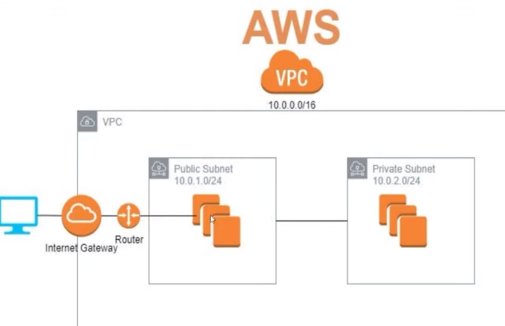
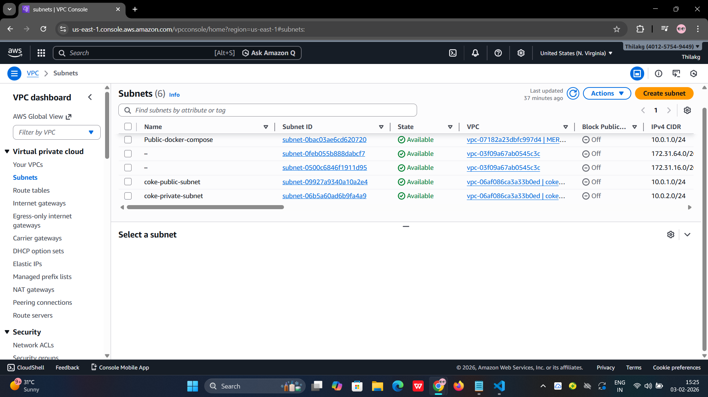
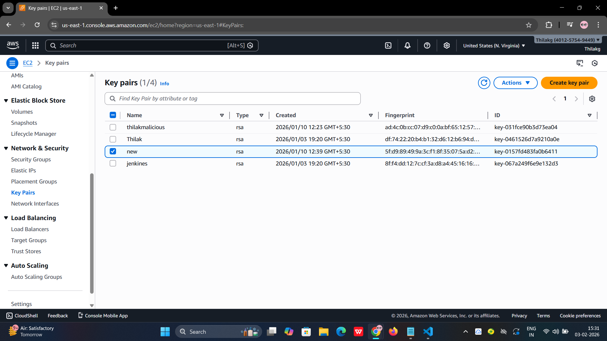
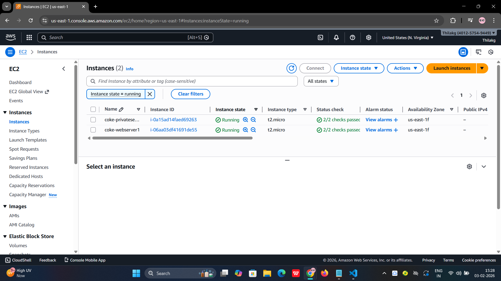

# Terraform AWS Infrastructure Project

This project demonstrates how to provision **AWS infrastructure using Terraform**.  
It covers the creation of core networking components and EC2 resources using **Infrastructure as Code (IaC)** best practices.

---

## Project Overview

Using Terraform, this project provisions the following AWS resources:

- VPC
- Subnets
- Route Tables
- Internet Gateway
- EC2 Instance
- Key Pair

All resources are automated and reproducible using Terraform.

---

## AWS Architecture Diagram

The overall infrastructure architecture is shown below:



---

## VPC Configuration

This image shows the VPC created using Terraform:


---

## 📡 Subnet Configuration

Subnet creation inside the VPC:



---

## Route Table Configuration

Routing rules configured for public access:


---

## Key Pair Configuration

SSH Key Pair used to access the EC2 instance:



---

## EC2 Instance

EC2 instance provisioned using Terraform:



---

## Terraform Workflow

```bash
terraform init      # Initialize Terraform
terraform plan      # Preview the changes
terraform apply     # Create the infrastructure
terraform destroy   # Destroy the infrastructure
